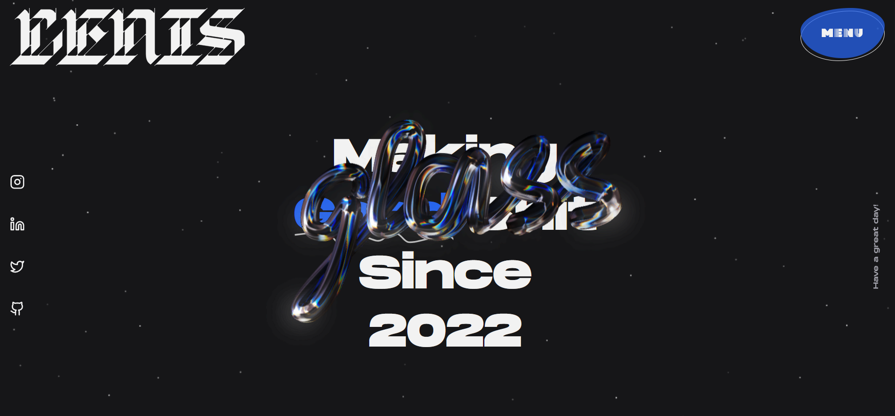
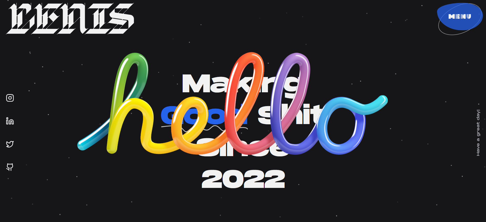
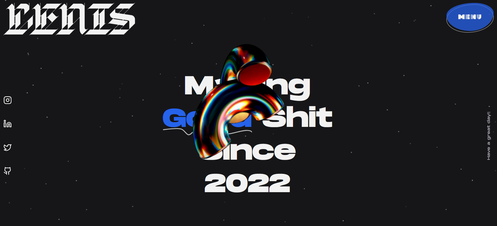
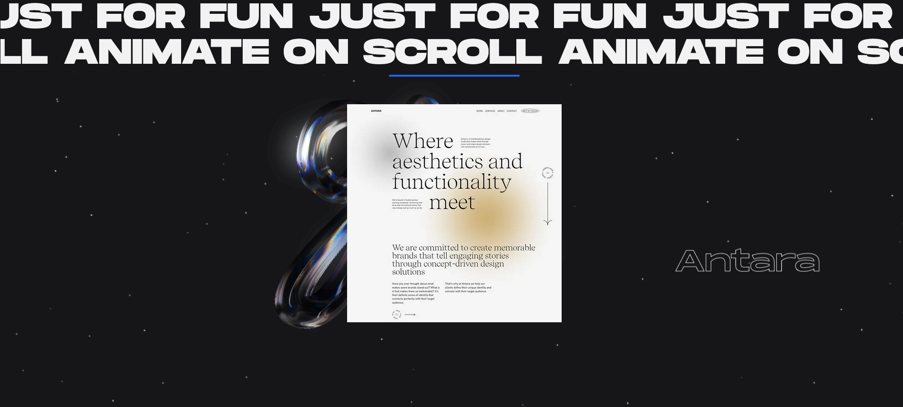

# Blog Next.js

This Layout made with Next.js, Shadcn UI(with Radix UI, Lucide Icons, Radix Colors), Stitches, PropType, Spline, Framer motion, Typed.js, React Wrap Balancer, Tailwind and Postcss.

## [Demo Link](https://blog-nextjs-temp.vercel.app/)









## Tech Stack

**Client:** Next.js, Shadcn(Radix UI), Stitches, Spline, Framer motion, Clsx, PropType, React Wrap Balancer, Typed.js, TailwindCSS, Postcss like Sass, Lucide Icons and Colors.

## Features

- Full screen vertical scroll(set css scroll snap to each layers)
- Svg path animation with framer motion
- Offcanvas with blob button and curve backdrop
- Magnetic social media links
- Custom svg component
- Vertical type writer text effect
- Spline 3d modules
- Parallax text, progress and image items
- Usefull custom hook
- Eslint, Prettier, Stylelint Husky and Lint-staged
- Gitflow

## Run Locally

Clone the project

```bash
  git clone https://github.com/AliBagheri2079/blog-nextjs.git

```

Go to the project directory

```bash
  cd blog-nextjs

```

Install dependencies

```bash
  npm install

```

Start the server

```bash
  npm run dev

```

Format the Component

```bash
  npm run format

```

linting the Component

```bash
  npm run lint
  npm run lint:style

```

## 🚀 About Me

I'm Ali Bagheri. Learning about 3 years on Frontend Development Position ...

## 🔗 Links

[](https://github.com/AliBagheri2079)

[](https://www.linkedin.com/in/alibagheri2079/)

[](https://twitter.com/AliBagheri2079)
